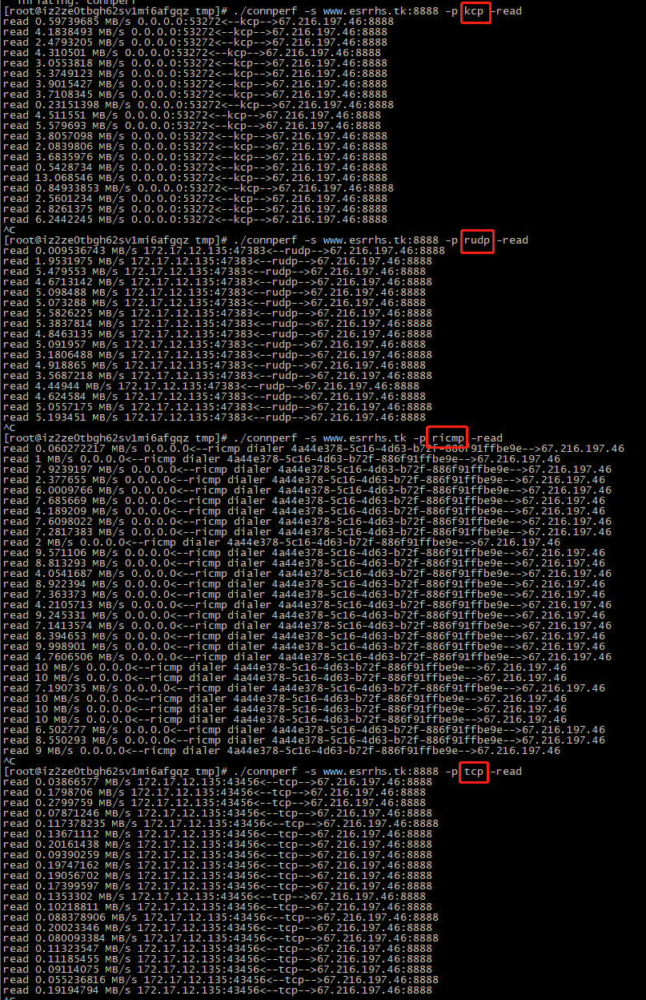

# connperf
多协议带宽测试工具，支持协议：tcp、rudp、ricmp、kcp

# 示例
* tcp server
```
# ./connperf -l :8888 -p tcp -read
read 2057 MB/s 127.0.0.1:8888<--tcp-->127.0.0.1:32758 
read 1169 MB/s 127.0.0.1:8888<--tcp-->127.0.0.1:32758 
read 1178 MB/s 127.0.0.1:8888<--tcp-->127.0.0.1:32758 
read 1633 MB/s 127.0.0.1:8888<--tcp-->127.0.0.1:32758 
```
* tcp client
```
# ./connperf -s 127.0.0.1:8888 -p tcp -write
write 2065 MB/s 127.0.0.1:32758<--tcp-->127.0.0.1:8888 
write 1168 MB/s 127.0.0.1:32758<--tcp-->127.0.0.1:8888 
write 1179 MB/s 127.0.0.1:32758<--tcp-->127.0.0.1:8888 
write 1629 MB/s 127.0.0.1:32758<--tcp-->127.0.0.1:8888 
```
* 使用docker
```
# docker run --rm --network host esrrhs/connperf ./connperf -l :8888 -p tcp -read
# docker run --rm --network host esrrhs/connperf ./connperf -s 127.0.0.1:8888 -p tcp -write
```

# 协议对比
* client位于阿里云，server位于北美，速度比较：tcp<kcp<rudp<ricmp

